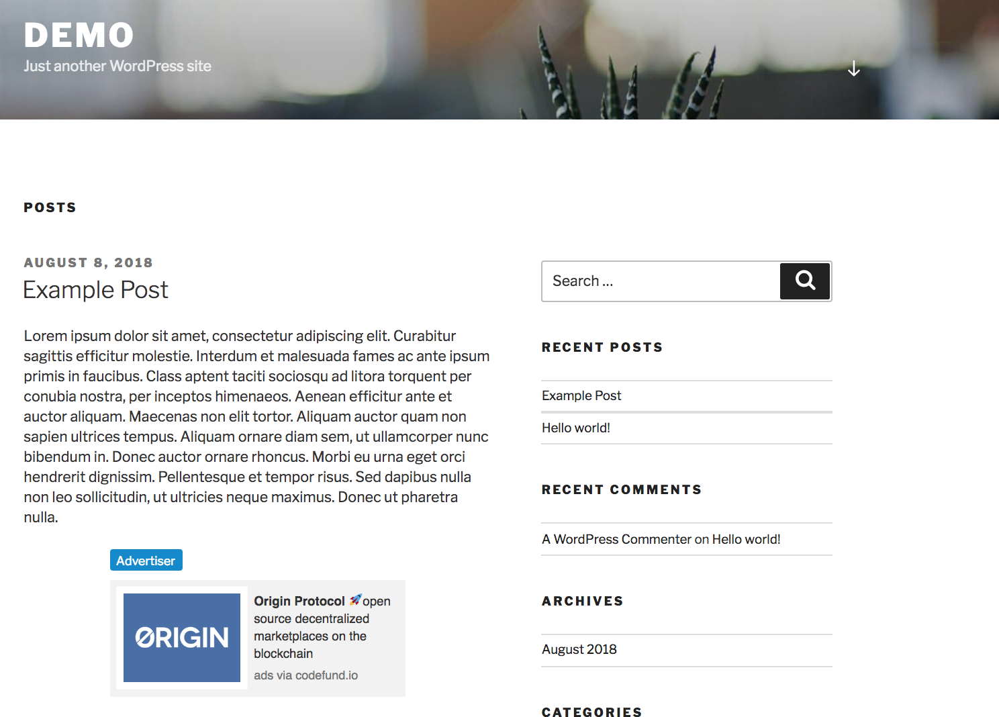

# Official CodeFund Wordpress Plugin

The official way to display ads from CodeFund on your Wordpress blog.

## Contents

The WordPress Plugin Boilerplate includes the following files:

* `README.md`. The file that you’re currently reading.
* A `screenshots` directory that contains screenshots of the ads on an example Wordpress blog and of the config panel.
* A `codefund` directory that contains the source code for the plugin.

## Features

* Display ads in your main post loop from CodeFund campaigns on your Wordpress blog.
* Configure how often (post count) you'd like to see your posts displayed in a dashboard in your Wordpress backend.

## Installation

* Copy `codefund` into `wp_content/plugins` folder in your wordpress site.
* Navigate to the plugins admin panel in the Wordpress backend and activate the plugin.
* Configure the plugin with your property ID.
   
  * You can get this in the CodeFund dashboard by viewing your property (where you get the embed javascript code from) and extract the ID from the source in the script.
  * i.e. ``
* Set the frequency for your ads to display. (Ads will display every 2 posts, i.e.)
   
* See your ads!
