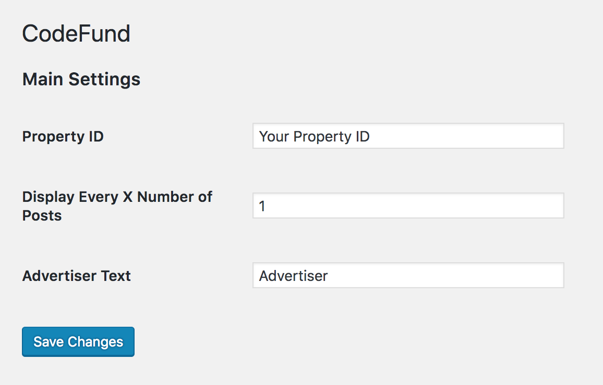
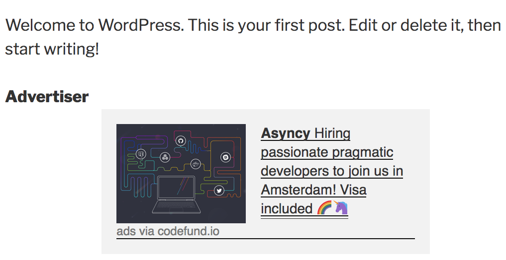

### CodeFund Wordpress Plugin

* Copy `codefund` into `wp_content/plugins` folder in your wordpress site.
* In Plugins admin, activate the plugin.
* Configure the plugin with your property ID.
   
  * You can get this in the CodeFund dashboard by viewing your property (where you get the embed javascript code from) and extract the ID from the source in the script.
  * i.e. ``
* Set the frequency for your ads to display. (Ads will display every 2 posts, i.e.)
   
* See your ads!
